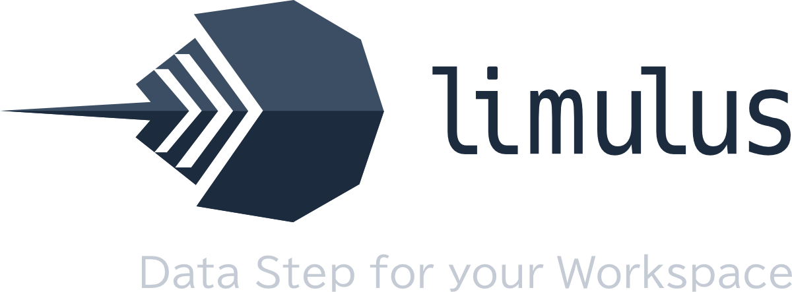

# limulus — Data Step for Your Workspace

[English](../README.md)

---



**limulus** はPython 上でデータステップの記法によりデータ処理を行うためのライブラリです。   
データステップの構文の簡潔さと安定性を、より広く活用できるようにすることを目的としています。

現在はαリリースで、βリリースまでにAPIなど破壊的無変更の可能性がある点には注意してください。

---

## インストール

```bash
pip install limulus
```

---

## 使い方

### 1. データの用意

csvから読み込むなど、DataFrame(arrow/poloarss/pandas) を用意します。

```python
import pandas as pd
import limulus

# データを読み込む
health_df = pd.DataFrame({
	"name": ["Alice", "Bob", "Charlie", "David"],
	"age": [25, 30, 35, 40],
	"height": [65, 70, 68, 72],  # inches
	"weight": [140, 180, 130, 200]  # pounds
})

# Session に参照情報を設定
session = limulus.Session()
session.loads({"health": health_data})
```

### 2. データステップの実行

データステップのコードを`session.submit()` に渡すだけです。

```python
session.submit("""
data result;
  set health;
  where age > 25;
  height_m = height * 0.0254;
  weight_kg = weight * 0.454;
  bmi = round(weight_kg / (height_m**2), 0.1);
  keep name age bmi;
run;
""")
```

複数のデータステップも一度に渡せます。前のステップで作ったデータセットはそのまま参照できます。

### 3. 結果を取り出す
簡単な方法はセッションから添字でarrowとして取り出すことです。  
arrowからは簡単にpandasなどに変換できます。

```python
df_out = session["result"].to_pandas()
print(df_out)
```
---


## ドキュメント

https://k-nkmt.github.io/limulus/


## ライセンス

[PolyForm Noncommercial License 1.0.0](../LICENSE)

現在は商用利用は制限しており、個人的な利用や非営利の教育・研究目的に限定して利用可能です。  
クリエイティブコモンズライセンスはソフトウェアの配布には適さないことから、このプロジェクトではライセンスはPolyForm Noncommercial Licenseにより配布しています。  

将来的により広い利用が可能なライセンスへの変更も検討しています。  

お問い合わせ: info@knworx.com  

---

## 表示事項

**プロジェクトの位置づけ**  
limulus は Python および Rust で独立して実装された、データステップの構文を使用するデータ変換フレームワークです。  
SAS Institute Inc. とは無関係であり、同社の承認は受けていません。

**商標に関する表示**  
SAS® は SAS Institute Inc. の登録商標です。その他のすべての商標はそれぞれの所有者に帰属します。

**独立実装の表明**  
このプロジェクトは独立した実装です。SAS のソースコードや独自素材は一切使用していません。

**互換性に関する免責事項**  
SAS ソフトウェアとの互換性は保証されておらず、プロジェクトの目標でもありません。  
現代的な機能を提供するために、一部の動作は意図的に異なっています。